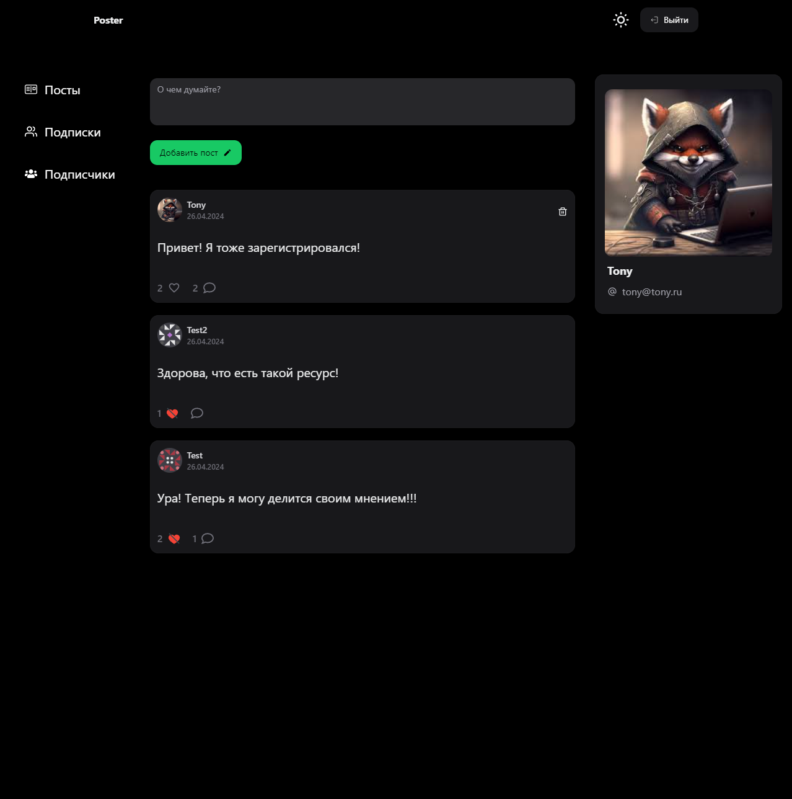

<h1>"Poster: Серверная часть приложения - Пет проект"</h1>
<div align="center">
  
</div>

<h2>Используемые технологии:</h2>
<ul>
  <li>Node JS</li>
  <li>Express JS</li>
  <li>MongoDB</li>
  <li>Docker</li>
  <li>База данных из Docker</li>
</ul>

# Для запуска проекта, необходимо выполнить следующие шаги:

1. Склонировать репозиторий с api по ссылке [https://github.com/arshtnkv/poster-express-api.git](https://github.com/arshtnkv/poster-express/tree/main) на свой компьютер.
```
git clone https://github.com/arshtnkv/poster-express-api.git
```

2. Склонировать репозиторий с клиентским приложением по ссылке https://github.com/arshtnkv/poster-react.git на свой компьютер.
```
git clone https://github.com/arshtnkv/poster-react.git
```

3. Установить зависимости
```
npm i
```

4. Открыть терминал (или командную строку) и перейти в корневую директорию сервера.
```
cd poster-express-api
```

5. Переименовать файл .env.local (убрать .local)
```
.env
```

6. Запустить команду docker compose которая поднимет сервер, клиент и базу данных
```
docker compose up
```

7. Открыть браузер и перейти по адресу http://localhost:80, чтобы увидеть запущенный проект.
